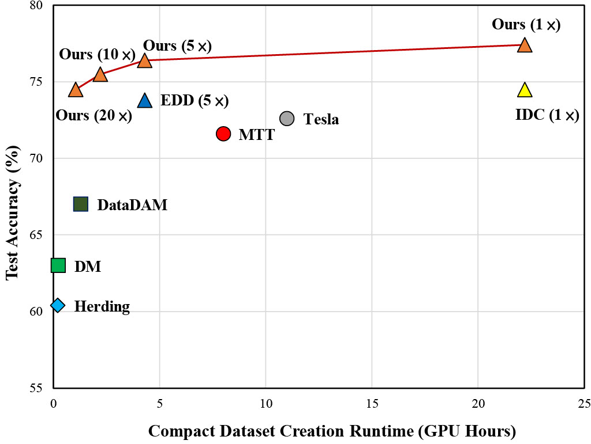
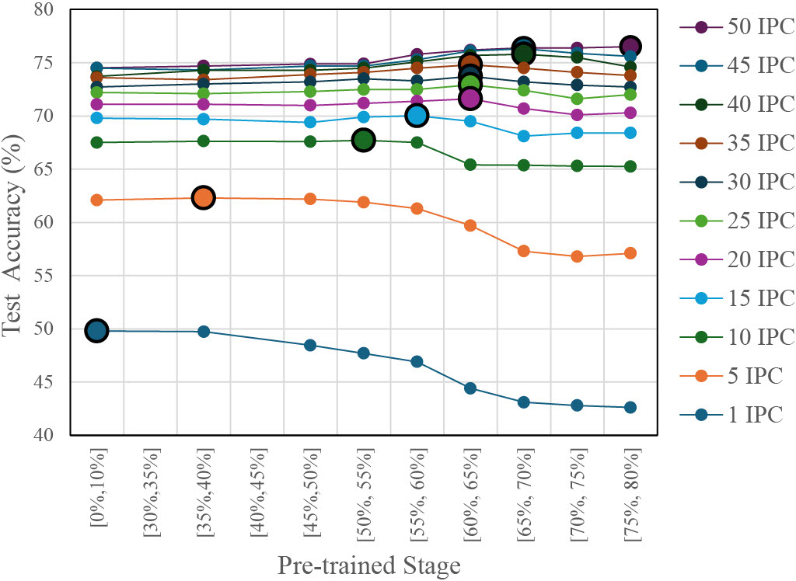
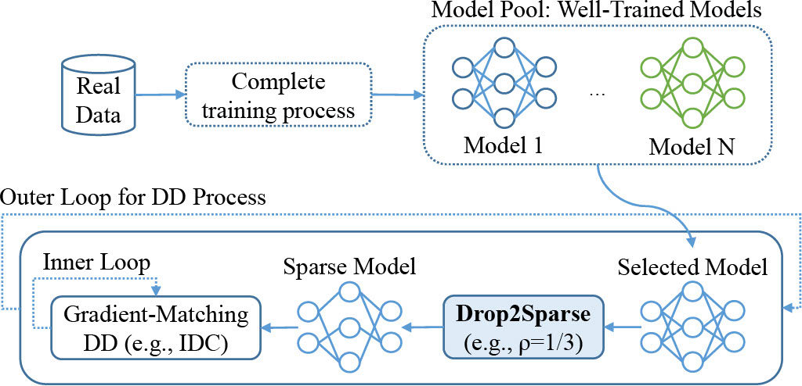

# Drop2Sparse: Improving Dataset Distillation via Sparse Model

Official implementation of *Drop2Sparse: Improving Dataset Distillation via Sparse Model* (Published in IEEE Transactions on Circuits and Systems for Video Technology).

## Overview

The success of modern deep learning algorithms requires large amounts of training data, which leads to high computational and storage costs. Dataset Distillation (DD) is a rising research field that resolves this issue by synthesizing a compact training dataset from a large one. Recent gradient matching DD methods have achieved remarkable results. However, these methods typically utilize weak models for DD performance improvement, while well-trained models are often considered inferior choices due to their lower performance. Conversely, our study provides new insights into the role of well-trained models in DD, particularly under high-storage budget scenarios. We identify a previously overlooked design principle—a positive correlation between model capability and storage budget. Based on this principle, we propose Drop2Sparse, an approach that randomly sparsifies well-trained models to create efficient models for various storage budget scenarios. Drop2Sparse concurrently infuses significant model diversity and regularization effects into DD, outperforming previous state-of-the-art methods by up to 3.8% on CIFAR and 3.6% on ImageNet-subset. Moreover, our method exhibits remarkable cross-architecture generalization and achieves promising results even under challenging scenarios, such as using an extremely reduced model pool or highly accelerated training.

<div align="center" style="display: flex; justify-content: center; align-items: flex-start; gap: 10px;">
  
  
</div>


## Supported Datasets

- CIFAR-10
- CIFAR-100
- ImageNet-10
- ImageNet-100

## Preparation
<div align="center">
  
  <p><b>Figure:</b> The workflow of the dataset distillation process, illustrating the integration of Information-Intensive Dataset Condensation (IDC) with our proposed Drop2Sparse module.</p>
</div>
Before running experiments, ensure that you have a well-trained model pool ready. These pretrained models serve as a foundation for effective dataset distillation, helping to enhance generalization and reduce computational overhead.

### Pretraining Well-trained Models
To train well-performing models on real datasets, use the following command:

```
python train.py -d [dataset] -n [network] --epochs [epoch]
```

- `-d`: Dataset name.
- `-n`: Model architecture.
- `--epochs`: Number of training epochs.

## Running Experiments

### Generating Compressed Data

To synthesize a condensed dataset, run:

```
python condense.py --reproduce -d [dataset] --ipc [ipc] --sample_accrange [min_acc] [max_acc] --pool_number [num] --depth [depth] -n [network] --apply_pruning --pruning_ratio [ratio] --pruning_type [type]
```

Example:

```
python condense.py --reproduce -d cifar10 --ipc 1 --sample_accrange 70 80 --pool_number 5 --depth 3 -n convnet --apply_pruning --pruning_ratio 0.8 --pruning_type global
```

- `-d`: Dataset name.
- `--ipc`: Number of images per class in the condensed dataset.
- `--sample_accrange`: Range of model accuracy for model selection.
- `--pool_number`: Number of models in the pool.
- `--depth`: Model depth.
- `-n`: Model architecture (`convnet`, etc.).
- `--apply_pruning`: Enables model pruning.
- `--pruning_ratio`: Pruning percentage (`0.8` means 80% of weights removed).
- `--pruning_type`: Type of pruning (`global`, etc.).

#### Accelerating Condensation via Multi-processing

To accelerate condensation on large datasets like ImageNet, multi-processing can be used to divide the dataset into class partitions and run condensation in parallel. Use `condense_mp.py` with the following arguments:

- `--nclass_sub`: Number of classes per partition
- `--phase`: Index of the partition to process (e.g., 0, 1, 2, ...)

Each processor should be assigned a unique `--phase` value to avoid overlap. The condensed data from each partition will be combined during evaluation.

Example for ImageNet-100 using 5 partitions:

```
python condense_mp.py --reproduce -d imagenet --nclass 100 -f [factor] --ipc [image/class] --nclass_sub 20 --phase [0,1,2,3,4]
```

## Training Neural Networks on Condensed Data

Set `--data_dir` and `--imagenet_dir` in `argument.py` to point to the folder containing the original dataset (required for measuring test accuracy). Then run the following command:

```
python test.py -d [dataset] -n [network] -f [factor] --ipc [image/class] --repeat [#repetition] --name [folder name] --niter [num_iteration]
```

- To evaluate Drop2Sparse, set `-f 3` for ImageNet and `-f 2` for other datasets.
- For detailed explanation of arguments, please refer to `argument.py`.

Example:

To evaluate Drop2Sparse (10 images/class) on CIFAR-10 using ConvNet-3 for 3 repetitions, run:

```
python test.py -d cifar10 -n convnet -f 2 --ipc 1 --repeat 3 --name "cifar10/conv3in_grad_mse_nd2000_cut_niter2000_factor2_lr0.0005_mom_img0.5_mix_ipc:1_sample_accrange:(70-80)_poolNumber: 5_pretrained:conv3in_cut_dsa_p" --niter 2000
```

## Citation

If you use this code, please cite our work:

```
@article{
author={Ting-Feng Huang and Yu-Hsun Lin},
title={Drop2Sparse: Improving Dataset Distillation via Sparse Model},
journal={IEEE Transactions on Circuits and Systems for Video Technology},
year={2025},
}
```
